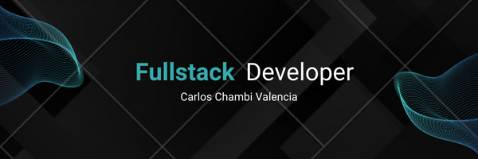

## 👨‍💻 About Me

<details>
  <summary>Click to expand! 🔍</summary>

🔸 Tengo 19 años, vivo en La Paz, Bolivia.

🔸 Actualmente me encuentro cursando el bootcamp henry, en donde pude mejorar ejercitar mis capacidades técnicas, pero sobre todo mis capacidades sociales como programador.

🔸 Mi experiencia como desarrollador esta basada en varios proyectos que realice en el trascurso del bootcamp, además de algunos proyectos personales que realice mientras estudiaba de forma autodidacta.

</details>

## 🤝 Connect with me

<p align="left">

<a href="mailto:carlos65357@gmail.com" >Send Me an Email | [LinkedIn](https://www.linkedin.com/in/carlos-chambi-a5b89818a)
</img>

</p>

## 🛠 Languages and Tools :

- ### Core

  <p align="left">
    
    
    
    
    
  </p>

- ### Frameworks of design

  

- ### Testing

  
  

- ### Database

  
  
  
  

- ### Others

  
  
  
  
  

## 📚 In learning

  
  
  
<!-- ## 💼 Portfolio

[View my Resume](https://drive.google.com/file/d/1E4pXgVt5TMaiyeC45wxBKRTnvBbvVO4b/view?usp=sharing) | [Portfolio](https://jruizsilva.netlify.app) -->

[](https://github.com/Khatanna)
[](https://github.com/Khatanna)

<div align="center">

```
"Art challenges technology and technology inspires art."
John Lasseter
```

</div>


<!-- <div align="center">

💼 If you want to see some of my work please visit my [portfolio](https://portfolio.byroncorrea.com).

📩 Email: contact@byroncorrea.com

</div > -->
